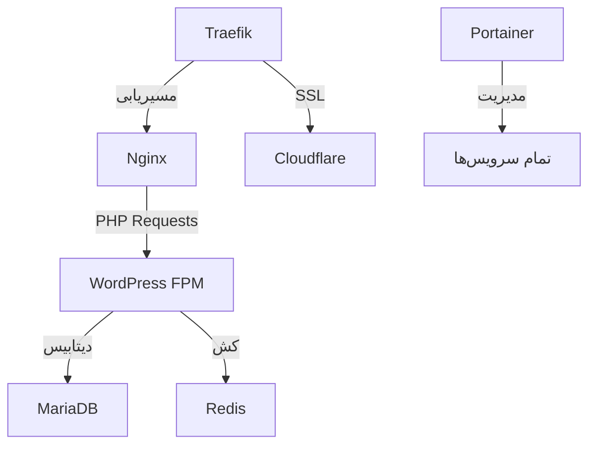

# استک داکر وردپرس با عملکرد بالا 🚀


این پروژه یک قالب آماده و حرفه‌ای برای راه‌اندازی سریع وردپرس با Docker است که عملکرد و امنیت بالایی ارائه می‌دهد.

## ✨ ویژگی‌های کلیدی

- 🚀 راه‌اندازی خودکار با اسکریپت نصب
- 🔒 SSL خودکار با Traefik و Cloudflare
- ⚡ بهینه‌سازی سرعت با Nginx، Redis و PHP-FPM
- 🛡️ امنیت پیشرفته با ایزوله‌سازی داکر
- 📦 مدیریت آسان با Portainer
- 🔄 پشتیبانی از چند سایت مستقل

## 🏗️ معماری سیستم



## 🚀 شروع سریع

### پیش‌نیازها
- سرور Ubuntu 22.04/24.04
- دامنه تنظیم شده روی Cloudflare
- API Token از Cloudflare

### نصب و راه‌اندازی

```bash
git clone https://github.com/WebCodex-ir/docker-wordpress-stack.git
cd docker-wordpress-stack
cp .env.example .env
nano .env  # ویرایش تنظیمات
chmod +x install.sh
sudo ./install.sh
```

## 🛠️ مدیریت سایت‌ها

### افزودن سایت جدید

1. ویرایش `docker-compose.yml`:

```yaml
new-site:
  image: nginx:stable-alpine
  volumes:
    - ./data/wordpress-new:/var/www/html
  labels:
    - "traefik.http.routers.new-site.rule=Host(`new.domain.com`)"
    - "traefik.http.routers.new-site.tls=true"
```

2. اعمال تغییرات:
```bash
sudo docker compose up -d
```

## 🔄 بکاپ و بازیابی

### گرفتن بکاپ
```bash
sudo tar -czvf backup-$(date +%Y-%m-%d).tar.gz ./data
```

### بازیابی
```bash
sudo tar -xzvf backup-YYYY-MM-DD.tar.gz
sudo docker compose up -d
```

## 📊 مانیتورینگ و عیب‌یابی

| دستور | توضیح |
|-------|-------|
| `docker ps` | مشاهده کانتینرهای فعال |
| `docker compose logs -f` | مشاهده لاگ‌های زنده |
| `docker exec -it [container] bash` | ورود به کانتینر |

## 🤝 مشارکت

مشارکت‌های شما باعث بهبود این پروژه می‌شود! لطفاً:

1. پروژه را Fork کنید
2. شاخه جدید ایجاد کنید (`git checkout -b feature/AmazingFeature`)
3. تغییرات را Commit کنید (`git commit -m 'Add some AmazingFeature'`)
4. Push کنید (`git push origin feature/AmazingFeature`)
5. Pull Request باز کنید

## 📜 مجوز

این پروژه تحت مجوز MIT منتشر شده است. برای اطلاعات بیشتر فایل [LICENSE](LICENSE) را مطالعه کنید.

---

<p align="center">
  با ❤️ توسط <a href="https://webcodex.ir">وب‌کدکس</a>
</p>
